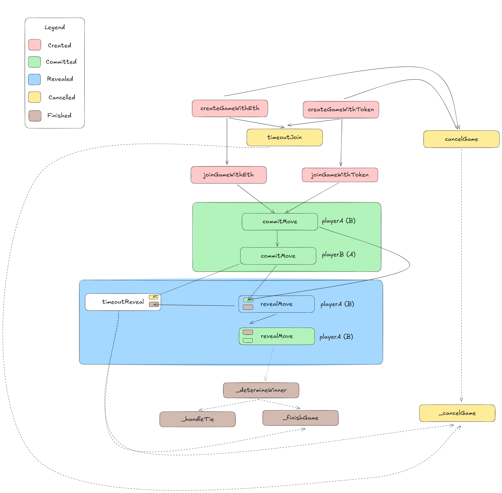

# Unresponsive Player

## Summary

A player can become unresponsive by not committing, forcing the active player to call `timeoutReveal()` which only refunds both instead of rewarding the winner.

## Description

### Normal Behavior

- Both players must commit and reveal each turn
- If one player becomes unresponsive while the other remains active, the reward should go to the legitimate player

### Issue



Looking at the flow, the game doesn't have a mechanism to resolve the case where one player becomes unresponsive. There are many reasons a player may become unresponsive: offline, forgot to commit, off-chain web issues, internet latency, etc.

Especially problematic is deliberate unresponsiveness. When a losing player knows they will lose, there's no incentive to continue playing. They can simply quit the game to avoid losing more gas, denying the winner their rightful reward.

## Risk

### Impact

**High**

- Winning player is denied their rightful reward and must pay gas to get a refund
- Encourages losing players to quit the game

### Likelihood

**High**

- Doesn't require contract deployment or complex transactions
- In the real world, many situations cause players to become unresponsive
- Losing players have no incentive to continue playing

## Proof of Concept

### Textual PoC

1. PlayerA creates a game
2. PlayerB joins the game
3. During gameplay, playerB realizes they will lose
4. PlayerB stops committing moves, becoming unresponsive
5. PlayerA must wait for timeout and call `timeoutReveal()`
6. Game is cancelled and both players are refunded, denying playerA their earned reward

### Coded PoC

[UnresponsivePlayer.t.sol](../test/UnresponsivePlayer.t.sol)

## Recommended Mitigation

Add commit timeout logic to reward the responsive player:

```diff
contract RockPaperScissors {
+   uint256 immutable commitInterval;

    struct Game {
        //...
+       uint256 commitDeadline;
    }

+   function timeoutCommit(uint256 _gameId) external {
+       Game storage game = games[_gameId];

+       require(
+           msg.sender == game.playerA || msg.sender == game.playerB,
+           "Not a player in this game"
+       );
+       require(game.state == GameState.Committed, "Game not in commit phase");
+       require(
+           block.timestamp > game.commitDeadline,
+           "Commit phase not timed out yet"
+       );
+
+       bool playerACommitted = game.commitA != bytes32(0);
+       bool playerBCommitted = game.commitB != bytes32(0);
+
+       if (msg.sender == game.playerA && playerACommitted && !playerBCommitted) {
+           // Player A wins by timeout
+           _finishGame(_gameId, game.playerA);
+       } else if (
+           msg.sender == game.playerB && playerBCommitted && !playerACommitted
+       ) {
+           // Player B wins by timeout
+           _finishGame(_gameId, game.playerB);
+       } else if (!playerACommitted && !playerBCommitted) {
+           _cancelGame(_gameId);
+       } else {
+           revert("Invalid timeout claim");
+       }
+   }

    function commitMove(uint256 _gameId, bytes32 _commitHash) external {
        Game storage game = games[_gameId];

        require(
            msg.sender == game.playerA || msg.sender == game.playerB,
            "Not a player in this game"
        );
        require(
            game.state == GameState.Created ||
                game.state == GameState.Committed,
            "Game not in commit phase"
        );

+       uint256 commitDeadline = game.commitDeadline; // Gas saving
+       if (commitDeadline == 0) {
+           game.commitDeadline = block.timestamp + commitInterval;
+       }
+       require(block.timestamp < commitDeadline, "Commit deadline passed");

        if (
            game.currentTurn == 1 &&
            game.commitA == bytes32(0) &&
            game.commitB == bytes32(0)
        ) {
            // First turn, first commits
            require(game.playerB != address(0), "Waiting for player B to join");
            game.state = GameState.Committed;

        } else {
            // Later turns or second player committing
            if(block.timestamp)
            require(game.state == GameState.Committed, "Not in commit phase");
            require(
                game.moveA == Move.None && game.moveB == Move.None,
                "Moves already committed for this turn"
            );
        }

        if (msg.sender == game.playerA) {
            require(game.commitA == bytes32(0), "Already committed");
            game.commitA = _commitHash;
        } else {
            require(game.commitB == bytes32(0), "Already committed");
            game.commitB = _commitHash;
        }

        emit MoveCommitted(_gameId, msg.sender, game.currentTurn);

        // If both players have committed, set the reveal deadline
        if (game.commitA != bytes32(0) && game.commitB != bytes32(0)) {
            game.revealDeadline = block.timestamp + game.timeoutInterval;
+           game.commitDeadline = 0;
        }
    }
//...
}
```
